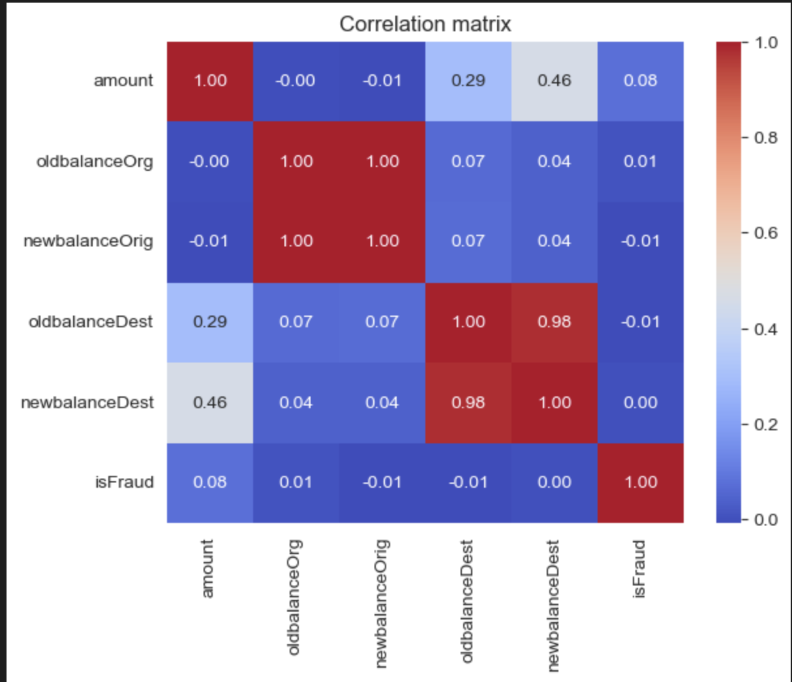
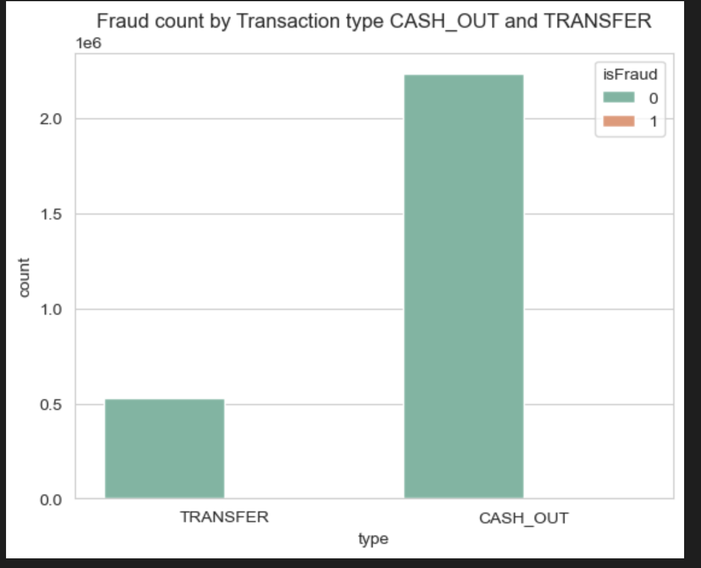
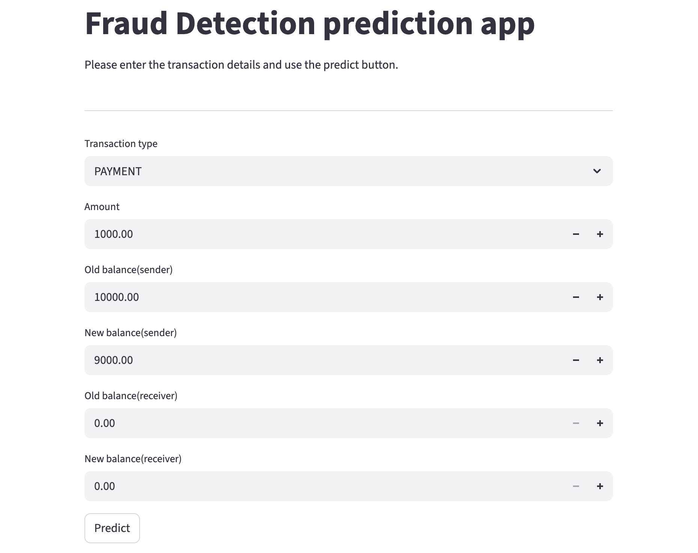

# 💳 Large-Scale Fraud Detection System (6.3M Transactions) using Random Forest & Streamlit

## 📌 Project Overview

This project builds a Machine Learning-based Fraud Detection System trained on over **6.3 million financial transactions**.  

The model detects whether a transaction is **fraudulent or legitimate** and is deployed using a **Streamlit web application** for real-time prediction.

The dataset is highly imbalanced (only ~0.13% fraud cases), making this a real-world fraud detection problem.

---

## 📊 Dataset Information

- Total Transactions: **6,362,620**
- Fraudulent Transactions: **8,213**
- Fraud Rate: **0.13%**
- Features Used:
  - Transaction Type
  - Amount
  - Old Balance (Sender)
  - New Balance (Sender)
  - Old Balance (Receiver)
  - New Balance (Receiver)

---

## 🔎 Exploratory Data Analysis (EDA)

Performed detailed EDA including:

- Transaction type distribution
- Fraud percentage calculation
- Fraud rate by transaction type
- Log transformation for skewed amount distribution
- Boxplot comparison of fraud vs non-fraud
- Correlation matrix
- Business pattern detection (zero balance after transfer)

### 📌 Correlation Matrix

![Correlation Matrix]

### 📌 Fraud Distribution by Transaction Type

![Fraud Count]

---


## ⚙️ Machine Learning Pipeline

Built using Scikit-learn Pipeline with:

- ColumnTransformer
- OneHotEncoder (for transaction type)
- RandomForestClassifier (n_estimators=100, max_depth=10)

Why Random Forest?

- Handles non-linear patterns
- Robust to outliers
- Works well on large datasets
- No scaling required

---

## 📈 Model Performance
Accuracy = 99.96%


### Classification Report:

| Class | Precision | Recall | F1-Score |
|-------|-----------|--------|----------|
| Non-Fraud (0) | 1.00 | 1.00 | 1.00 |
| Fraud (1) | 0.99 | 0.72 | 0.83 |

### Confusion Matrix:

[[1906300, 22],
 [690, 1774]]

### Key Business Insight

- Only 22 false positives out of 1.9M transactions
- 99% precision on fraud detection
- Successfully detected 72% of fraud cases
- Extremely low false alarm rate


### ROC-AUC Score

The model achieved a high ROC-AUC score, demonstrating strong ability to separate fraudulent and legitimate transactions even under severe class imbalance (~0.13% fraud rate).

## 🖥️ Streamlit Web Application

An interactive web app where users can:

- Select transaction type
- Enter transaction amount
- Provide sender & receiver balances
- Click predict to check fraud probability

### App Screenshot

![App Screenshot]

---

## 🚀 How to Run the Project

### 1️⃣ Clone the Repository

```bash
git clone https://github.com/your-username/your-repo-name.git
cd your-repo-name


2️⃣ Install Dependencies
pip install -r requirements.txt


3️⃣ Run the Streamlit App
streamlit run fraud_detection.py


##Technologies Used

Python
Pandas
NumPy
Matplotlib
Seaborn
Scikit-learn
Streamlit
Joblib


📂 Project Structure
├── EDA.ipynb
├── fraud_detection.py
├── fraud_detection_model.pkl
├── requirements.txt
└── README.md


🔥 Key Highlights

✔ Trained on 6.3M+ real-world transactions  
✔ Severe class imbalance (0.13% fraud) handled effectively  
✔ Achieved 99% precision on fraud detection  
✔ Only 22 false positives out of 1.9M test transactions  
✔ End-to-end ML pipeline  
✔ Model serialized using joblib  
✔ Interactive Streamlit web application  
✔ Production-ready evaluation metrics  


📌 Future Improvements

✔ Threshold tuning for higher recall  
✔ Add XGBoost / LightGBM comparison  
✔ Add Precision-Recall curve visualization  
✔ Deploy on Streamlit Cloud / AWS  
✔ Add SHAP model explainability  
✔ Add real-time API using Flask/FastAPI  


## 🧠 Technical Challenges Solved

- Handled large-scale dataset (6.3M rows, 534MB memory usage)
- Managed extreme class imbalance (0.13% fraud)
- Reduced false positives to near zero
- Optimized training on Mac M2 using parallel processing (n_jobs=-1)
- Built scalable ML pipeline using ColumnTransformer


## 📂 Dataset

The dataset contains over 6.3 million financial transactions.

Due to its large size, it is not included in this repository.

You can download the dataset from the original source (https://www.kaggle.com/datasets/amanalisiddiqui/fraud-detection-dataset).


👨‍💻 Author
git
Vikash Singh
Machine Learning Enthusiast
India 🇮🇳
